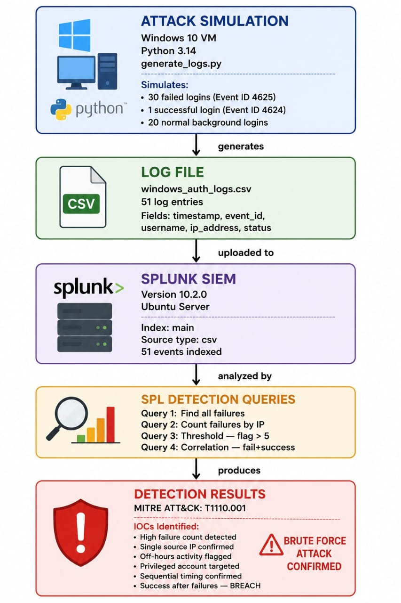
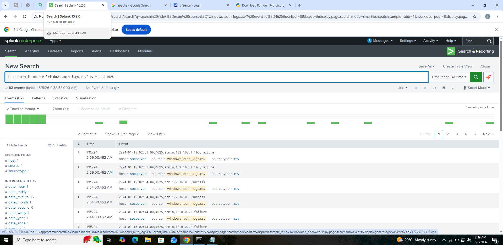
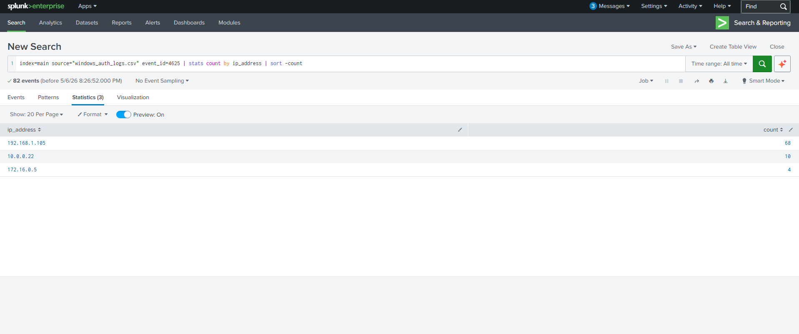
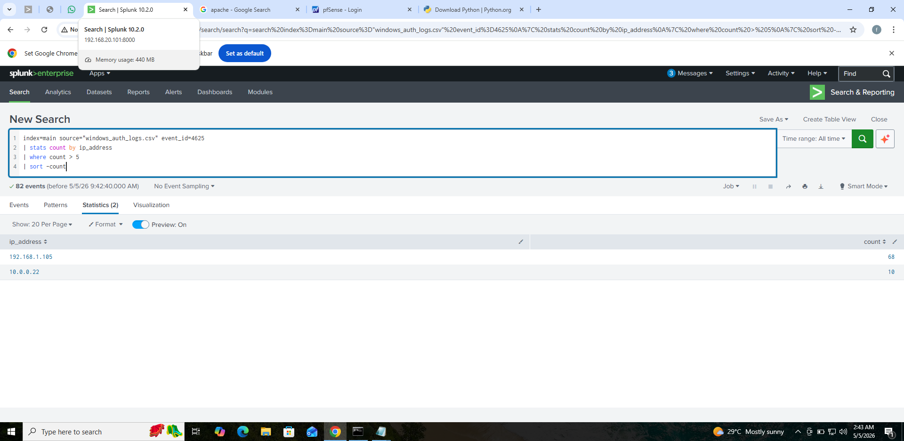
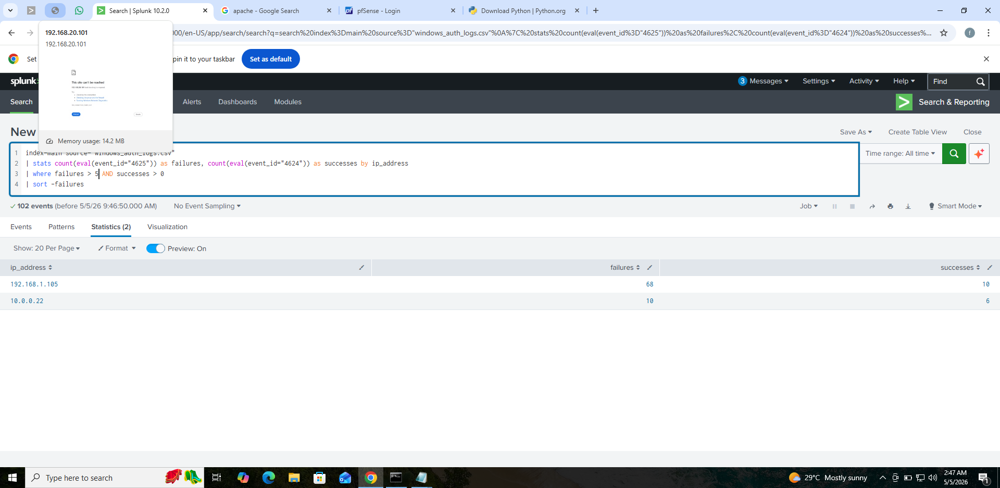

# 🔍 Brute Force Attack Detection Using Splunk
### Detecting Authentication Attacks with SIEM Technology

---

## 🎯 What This Project Is About

This project detects brute force login attacks using Splunk SIEM and simulated Windows authentication logs.

A brute force attack happens when an attacker repeatedly tries different passwords against one account until they get in. This project simulates that attack, ingests the logs into Splunk and writes detection logic that automatically identifies the attacker.

**Attack type:** Brute Force Authentication

**Detection method:** Threshold and Correlation

**Tools:** Python, Splunk, SPL

---

## 🧠 Understanding the Attack

### What is a Brute Force Attack?
An attacker uses automated software to try thousands of passwords against one account until one works.

02:00:00 - Failed login - admin account
02:00:10 - Failed login - admin account
02:00:20 - Failed login - admin account
... repeated 30 times ...
02:05:10 - SUCCESS - admin account

### Why Do Attackers Use It?
- Automated tools can try thousands of passwords per minute
- Targets accounts with weak passwords
- Common against internet-facing services like SSH, RDP and web portals

### How Windows Records This
Windows logs every login attempt as an Event ID:

| Event ID | Meaning | Indicates |
|---|---|---|
| 4625 | Failed login | Wrong password attempted |
| 4624 | Successful login | Correct password found |

### The Detection Pattern
Many 4625s from same IP → then one 4624 = Brute force attack confirmed

### Two Detection Techniques Used

Threshold logic — set a limit:
If any IP fails more than 5 times → flag it

Correlation logic — connect two events:
If same IP fails many times AND then succeeds
→ confirmed brute force attack

---

## 🎯 MITRE ATT&CK Mapping

| Field | Details |
|---|---|
| Tactic | Credential Access (TA0006) |
| Technique | Brute Force (T1110) |
| Sub-technique | Password Guessing (T1110.001) |
| Reference | attack.mitre.org/techniques/T1110 |

### What This Means
MITRE ATT&CK is a globally recognized framework that documents real world attack techniques used by threat actors.

Credential Access (TA0006) is the tactic — the attacker's goal is to steal or guess valid credentials to gain unauthorized access.

Brute Force (T1110) is the technique — the method used to achieve that goal by systematically trying passwords until one works.

Sub-technique T1110.001 specifically covers password guessing — trying common or likely passwords against known accounts.

---

## 🛠️ Prerequisites

### Operating System
Windows 10 or later (tested on Windows 10 VM)

### Required Tools
| Tool | Version | Purpose |
|---|---|---|
| Python | 3.14+ | Generate simulated log data |
| Splunk Enterprise | 10.2.0 | SIEM log analysis |

### Required Knowledge
- Basic understanding of what a SIEM is
- Basic understanding of Windows Event IDs
- No prior Python or Splunk experience needed — all commands are provided here

### Splunk Setup
Splunk Enterprise free trial available at:
splunk.com/en_us/download/splunk-enterprise.html
Free trial allows up to 500MB data per day which is sufficient for this project.

---

## Architecture

The diagram below shows the complete detection
pipeline from attack simulation to confirmed detection.

### How It Works
1. Python simulates a brute force attack on Windows VM
2. Attack generates a CSV log file with 51 entries
3. Logs uploaded to Splunk SIEM on Ubuntu Server
4. SPL queries analyze logs using threshold and correlation detection logic
5. Detection results confirm attack with IOCs mapped to MITRE ATT&CK T1110.001

---

## 📁 Project Files

| File | Purpose |
|---|---|
| generate_logs.py | Python script to simulate attack logs |
| windows_auth_logs.csv | Generated log file (created by script) |
| screenshots/ | Evidence of detection results |

---

## 🔬 Step by Step — How to Replicate

### Step 1 — Install Python

Download Python from python.org/downloads
During installation check the box:
Add Python to PATH

Verify installation:
Open Command Prompt and type:
python --version

Expected output:
Python 3.14.x

---

### Step 2 — Create the Log Generator Script

Create a new file called generate_logs.py
and paste this code:

import csv
import random
from datetime import datetime, timedelta

users = ["alice", "bob", "admin", "john"]
ips = ["192.168.1.105", "10.0.0.22", "172.16.0.5"]
attacker_ip = "192.168.1.105"

rows = []
base_time = datetime(2024, 1, 15, 2, 0, 0)

for i in range(30):
    rows.append({
        "timestamp": (base_time + timedelta(seconds=i*10)).strftime("%Y-%m-%d %H:%M:%S"),
        "event_id": 4625,
        "username": "admin",
        "ip_address": attacker_ip,
        "status": "failure"
    })

rows.append({
    "timestamp": (base_time + timedelta(seconds=310)).strftime("%Y-%m-%d %H:%M:%S"),
    "event_id": 4624,
    "username": "admin",
    "ip_address": attacker_ip,
    "status": "success"
})

for i in range(20):
    rows.append({
        "timestamp": (base_time + timedelta(minutes=random.randint(1, 60))).strftime("%Y-%m-%d %H:%M:%S"),
        "event_id": random.choice([4624, 4625]),
        "username": random.choice(users),
        "ip_address": random.choice(ips),
        "status": random.choice(["success", "failure"])
    })

with open("windows_auth_logs.csv", "w", newline="") as f:
    writer = csv.DictWriter(f, fieldnames=["timestamp","event_id","username","ip_address","status"])
    writer.writeheader()
    writer.writerows(rows)

print("Log file created: windows_auth_logs.csv")

What this script creates:
- 30 failed logins from attacker IP every 10 seconds
- 1 successful login from same attacker IP
- 20 random normal logins as background noise
Total: 51 log entries

---

### Step 3 — Run the Script

Open Command Prompt and navigate to where you saved the file:
cd Desktop

Run the script:
python generate_logs.py

Expected output:
Log file created: windows_auth_logs.csv

Verify the file exists on your Desktop
and contains 51 rows of data.

---

### Step 4 — Upload Logs to Splunk

1. Open Splunk in your browser
   Default URL: http://localhost:8000

2. Go to Settings → Add Data → Upload

3. Select windows_auth_logs.csv

4. Set Source type to csv

5. Set Index to main

6. Click Review → Submit

Verify upload:
Go to Search and run:
index=main source="windows_auth_logs.csv"

Expected result: 51 events displayed

---

### Step 5 — Run Detection Queries

#### Query 1 — Find All Failed Logins
index=main source="windows_auth_logs.csv" event_id=4625

What this does:
Filters logs to show only failed login attempts.
The = sign means exactly equal to.

Expected result: 30+ failed login events

---

#### Query 2 — Count Failures by IP Address
index=main source="windows_auth_logs.csv" event_id=4625
| stats count by ip_address
| sort -count

What this does line by line:
Line 1 — get all failed logins
Line 2 — stats count by ip_address
  stats = calculate statistics
  count = count total events
  by ip_address = group results per IP
Line 3 — sort -count
  sort = order the results
  - means descending (highest first)

Expected result:
One IP address will have significantly more
failures than others — that is the attacker.

---

#### Query 3 — Flag Suspicious IPs
index=main source="windows_auth_logs.csv" event_id=4625
| stats count by ip_address
| where count > 5
| sort -count

What this does:
Adds one new line to Query 2:
| where count > 5
This filters results to only show IPs with
more than 5 failed attempts — your threshold.

This is called threshold detection — anything
above the limit is automatically flagged.

Expected result:
Only IPs exceeding 5 failures are shown.
The attacker IP will be clearly at the top.

---

#### Query 4 — Correlation Detection
index=main source="windows_auth_logs.csv"
| stats count(eval(event_id="4625")) as failures,
        count(eval(event_id="4624")) as successes
        by ip_address
| where failures > 5 AND successes > 0
| sort -failures

What this does line by line:
Line 1 — search all logs
Line 2 — count(eval(event_id="4625")) as failures
  eval checks if event_id equals 4625
  count counts how many times that is true
  as failures names the column failures
Line 3 — count(eval(event_id="4624")) as successes
  Same logic but for successful logins
Line 4 — by ip_address
  Groups everything per IP
Line 5 — where failures > 5 AND successes > 0
  Both conditions must be true at same time
  This is correlation — connecting two events
Line 6 — sort -failures
  Show highest failures first

Expected result:
Only IPs that failed many times AND succeeded
are shown — confirming brute force attack.

---

## 📊 Results

### Query 1 — All Failed Logins

What to look for:
All events should show event_id 4625
Status column should show failure

---

### Query 2 — Count by IP

What to look for:
One IP should have significantly more failures
This IP is your attacker

---

### Query 3 — Threshold Detection

What to look for:
Only IPs above your threshold of 5 are shown
The attacker IP should be clearly at top

---

### Query 4 — Smoking Gun

What to look for:
IPs with both high failures AND successes
This confirms the complete brute force pattern

---

## 🔍 Indicators of Compromise (IOCs)

IOCs are evidence that an attack has occurred. These are the digital fingerprints left by a brute force attack in Windows authentication logs.

### IOCs Detected in This Project

| IOC | Threshold | Significance |
|---|---|---|
| High failed login count | More than 5 per IP | Automated attack tool |
| Single source IP | Same IP across all attempts | One attacker origin |
| Off-hours activity | Outside 8AM-6PM | Avoids detection |
| Privileged account targeted | Admin account | Maximum access sought |
| Sequential timing | Regular intervals | Automated not manual |
| Success after failures | 4624 after many 4625s | Compromise confirmed |

### How to Use IOCs
When investigating a suspected brute force:
1. Check if multiple IOCs are present
2. One IOC alone may be a false positive
3. Three or more IOCs together = high confidence
4. Document all IOCs found for your report

### IOC Confidence Levels
| IOCs Present | Confidence | Action |
|---|---|---|
| 1 IOC | Low — monitor | Watch for more activity |
| 2 IOCs | Medium — investigate | Start investigation |
| 3+ IOCs | High — respond | Immediate response needed |

---

## 🧠 Understanding the Results

### What the Data Tells You

When you see an IP with:
- 30+ failed logins in 5 minutes
- Then 1 successful login
- All against same username

This means:
1. An automated tool tried many passwords
2. Eventually the correct password was found
3. The attacker now has access to that account

### What a SOC Analyst Does Next

After detecting this pattern a real analyst would:

1. Block the attacker IP at the firewall
2. Lock the compromised account immediately
3. Reset credentials with a strong password
4. Check what the attacker accessed after login
5. Escalate to Tier 2 for deeper investigation
6. Enable MFA to prevent future brute force

### Why This Detection Works

Threshold logic catches volume:
Normal users fail 1-2 times maximum
An attacker fails 30+ times

Correlation logic confirms intent:
Failing then succeeding proves the attack worked
Not just suspicious — confirmed compromise

---

## 💡 Key Learnings

| Concept | What I Learned |
|---|---|
| Event ID 4625 | Windows records every failed login |
| Event ID 4624 | Windows records every successful login |
| Threshold detection | Set a limit — anything above is suspicious |
| Correlation detection | Connect two events to confirm an attack |
| SPL stats command | Groups and counts log data |
| SPL where command | Filters results by condition |
| SPL eval command | Checks conditions within calculations |

---

## 🔗 References and Further Reading

- Splunk SPL documentation: docs.splunk.com
- Windows Security Event IDs: docs.microsoft.com
- MITRE ATT&CK Brute Force: attack.mitre.org/techniques/T1110

---

## 👤 Author
Fredrick Agufenwa

Cybersecurity Student | SOC Analyst in Training
